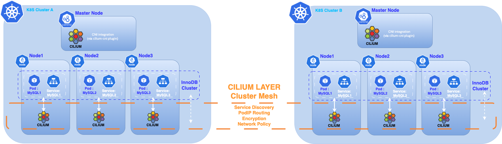
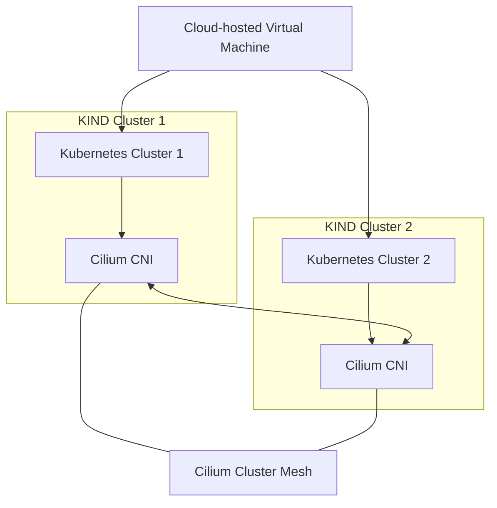
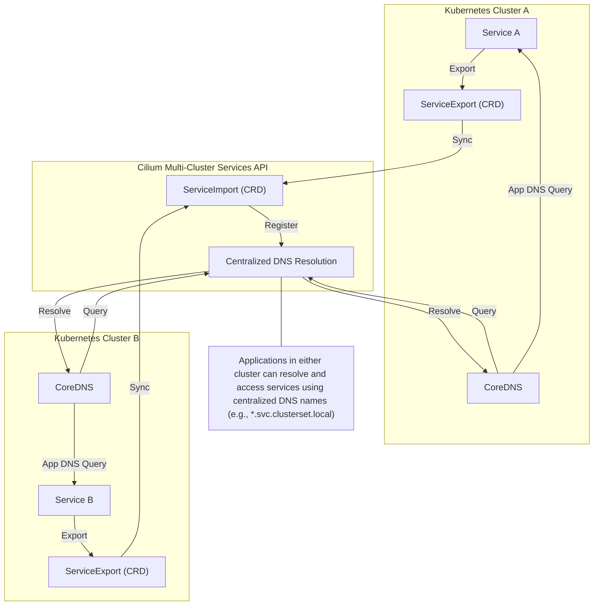

  

# 🚀 Deploying MySQL InnoDB ClusterSet Across Multiple Kubernetes Clusters with Cilium

## 📘 Introduction

This project demonstrates how to deploy a MySQL InnoDB ClusterSet across two Kubernetes clusters interconnected using Cilium Cluster Mesh.

We are building a unified, multi-cluster MySQL architecture with high availability and service discovery — all running on a single VM using lightweight Kubernetes environments.



---

## 🔧 Infrastructure Overview

The infrastructure consists of a single cloud-hosted virtual machine running two KIND (Kubernetes IN Docker) clusters. KIND provides a fast and convenient way to spin up Kubernetes clusters locally in Docker containers, making it ideal for development, testing, and experimentation.

Cilium is used as the CNI (Container Network Interface) plugin for both clusters, offering:
- ⚡️ Built-in LoadBalancer support
- 📡 Efficient L2 routing and service announcements
- 🔐 Powerful eBPF-based network policies
- 🔗 Cluster Mesh for seamless multi-cluster connectivity

With Cilium Cluster Mesh, pods and services in each cluster can discover and communicate across cluster boundaries as if they were on the same flat network, regardless of Kubernetes distribution or hosting location.


---

## 📝 Prerequisites

Before you begin, ensure you have:
- Two operational Kubernetes clusters (e.g., created with KIND)
- Cilium installed as the CNI plugin on both clusters
- The MySQL Operator installed on both clusters
- One MySQL InnoDB Cluster deployed in each Kubernetes cluster
- The `kubectl` command-line tool installed and configured

---

## 🐬 MySQL Deployment

Both clusters run MySQL Enterprise using the official MySQL Operator for Kubernetes, enabling:
- Native InnoDB Cluster support
- Automatic failover and recovery
- Seamless cross-cluster replication

> ⚠️ This article does not cover the installation of the Kubernetes clusters (KIND),the MySQL Operator or detailed deployment of InnoDB clusters.
> For step-by-step instructions, refer to:
> - [Kubernetes Test Platform with Kind and Cilium](https://github.com/colussim/kind-cilium-lab)
> - [MySQL Operator for Kubernetes - Documentation](https://dev.mysql.com/doc/mysql-operator/en/)
> - [Deploy a MySQL InnoDB Cluster on Kubernetes with MySQL Operator](https://github.com/colussim/mysql-innodb-k8s-operator)

> **⚠️ Note (MySQL Operator 9.4 for Kubernetes):**
>
> When you deploy an **InnoDBCluster**, the Operator **automatically creates a ClusterSet** with the **same name**.
>
> **Implications:**
> - You may see a `ClusterSet` resource even if you only requested a single cluster.
> - **Deleting the ClusterSet will also delete the associated InnoDBCluster.**
> - Plan your naming accordingly and avoid removing the ClusterSet unless you intend to remove the cluster as well.
>
> **Why this happens:**
> - The Operator prepares for future scale-out (adding replica clusters) without extra steps.
>
> **Recommendation:**
> - For standalone setups, keep the auto-created ClusterSet and operate your single cluster as usual. For multi-site setups, attach additional clusters to this ClusterSet.

---

## 🛠️ Step 1 – Setting Up Cluster Mesh

Before connecting the clusters with Cilium Cluster Mesh, ensure you have two Kubernetes clusters running with Cilium installed as the CNI.

Both clusters in this setup are created using KIND.

**🔍 Check Existing KIND Clusters**

To view the existing KIND clusters on your machine:
```bash
kind get clusters
```

List Kubernetes contexts:
```bash
kubectl config get-contexts
```

To switch context:
```bash
kubectl config use-context kind-k8sdemos2
```

**🐬 Checking MySQL InnoDB Cluster**

To list deployed InnoDB Clusters managed by the operator in each Kubernetes cluster:
```bash
kubectl get innodbclusters -A --context=kind-k8sdemos2
kubectl get innodbclusters -A --context=kind-k8sdemos3
```

**🛠️ Additional Requirements for Native Routing Paths**

To enable native routing across clusters in Cilium Cluster Mesh, each cluster’s Cilium must be configured with a native routing CIDR that covers all PodCIDR ranges of the connected clusters. All clusters must also use the same *maxConnectedClusters* value.

**🔍 Identify PodCIDR Ranges of Each Cluster**

Check PodCIDRs:
```bash
kubectl get nodes -o jsonpath='{range .items[*]}{.metadata.name}{" - "}{.spec.podCIDR}{"\n"}{end}'
```

If your clusters use PodCIDRs in the 10.x.x.x range, use the global routing CIDR 10.0.0.0/8.

**⚙️ Configure Cilium Native Routing CIDR**

Patch the Cilium ConfigMap:
```bash
kubectl patch configmap cilium-config -n kube-system --type merge -p '{"data": {"ipv4-native-routing-cidr": "10.0.0.0/8"}}'
```

**🔄 Restart Cilium DaemonSet**
```bash
kubectl rollout restart ds/cilium -n kube-system
```

**✅ Verify Configuration**
```bash
kubectl -n kube-system exec -it ds/cilium -- cilium status
cilium status --wait
```

> ⚠️ Repeat these modifications on the second cluster if necessary.

---

## 🛠️ Step 2 – Prepare the Clusters

Connect the two clusters using their respective kubectl contexts, stored in the environment variables $CLUSTER1 and $CLUSTER2.

Each cluster requires a unique, human-readable name and a numeric cluster ID (between 1 and 255).

**Cluster Name Requirements**
- Maximum length: 32 characters
- Must start and end with a lowercase alphanumeric character (a-z, 0-9)
- Can contain lowercase alphanumeric characters and dashes (-) in between

Patch ConfigMap for cluster_id:
```bash
kubectl patch configmap cilium-config -n kube-system --type merge -p '{"data": {"cluster-id": "1"}}'
```

> ⚠️ Ensure each cluster has a unique name and cluster ID.

Restart Cilium DaemonSet:
```bash
kubectl rollout restart ds/cilium -n kube-system
kubectl rollout restart deployment/cilium-operator -n kube-system
```

> ⚠️ Repeat on the second cluster.

---

## 🛠️ Step 3 – Enable Cluster Mesh

Run `cilium clustermesh enable` in each cluster context to:
- Deploy the clustermesh-apiserver
- Generate and import the required certificates as Kubernetes secrets
- Automatically detect the best LoadBalancer type to expose the ClusterMesh control plane

Set cluster contexts:
```bash
export CLUSTER1="kind-k8sdemos2"
export CLUSTER2="kind-k8sdemos3"
```

Enable ClusterMesh:
```bash
cilium clustermesh enable --context $CLUSTER1 --enable-kvstoremesh=false
cilium clustermesh enable --context $CLUSTER2 --enable-kvstoremesh=false
```

Wait for ClusterMesh to be ready:
```bash
cilium clustermesh status --context $CLUSTER1 --wait
```

**🔗 Connect Clusters**

Establish the ClusterMesh link:
```bash
cilium clustermesh connect --context $CLUSTER1 --destination-context $CLUSTER2
```

Check ClusterMesh status:
```bash
cilium clustermesh status --context $CLUSTER1
cilium clustermesh status --context $CLUSTER2
```

**🔍 Inspect Registered CiliumNodes**

List all CiliumNodes:
```bash
kubectl get ciliumnodes --context $CLUSTER1
```

If nodes from both clusters appear in each other’s list, ClusterMesh discovery is working as expected.

---

## 🛠️ Step 4 – Multi-Cluster Services API

By default, Cilium does not automatically configure CoreDNS to include the DNS search suffixes of other clusters when using ClusterMesh.

To enable DNS resolution across clusters for Multi-Cluster Services, you have two options:
1. Manually edit the CoreDNS ConfigMap to add the required search domains.
2. Install the Cilium Multi-Cluster Services (MCS) API CRDs.

**🌐 About Cilium MCS API CRDs**

The Cilium MCS API CRDs orchestrate DNS resolution and service connectivity between multiple Kubernetes clusters.

At the DNS level, they:
- Manage service names across clusters
- Enable seamless cross-cluster service discovery
- Allow applications in different clusters to access services using consistent and centralized DNS names



It is preferable to use the Cilium MCS API rather than the legacy Global Services feature, as MCS-API follows the Kubernetes multicluster standard (ServiceExport / ServiceImport), offers better interoperability, and is actively maintained.

⚠️ **Note:** In Cilium version [**1.18**](https://docs.cilium.io/en/stable/network/clustermesh/mcsapi/#gs-clustermesh-mcsapi), the CoreDNS `multicluster` plugin is **not automatically enabled** when using the Multi-Cluster Services API.  
This will change in [**v1.19**](https://docs.cilium.io/en/latest/network/clustermesh/mcsapi/), where CoreDNS can be automatically configured if `clustermesh.mcsapi.corednsAutoConfigure.enabled` is set to `true`.  

For Cilium **1.18**, you must manually update the CoreDNS ConfigMap to enable the `multicluster` plugin. 

**Why Patch CoreDNS and Modify its ConfigMap (MySQL InnoDB ClusterSet Context)**

While the MCS API handles DNS for *.svc.clusterset.local, MySQL InnoDB ClusterSet has additional requirements:
1. Full Pod FQDN Resolution: ClusterSet’s AdminAPI identifies each MySQL instance by its exact fully-qualified domain name and validates it during TLS handshakes.
2. Local Domain Differences: Your clusters use different local DNS suffixes (e.g. k8sdemos2.local, k8sdemos3.local). Without CoreDNS configuration, pods from one cluster cannot resolve the other’s local FQDNs.
3. NodePort for CoreDNS Service: By default, CoreDNS runs as a ClusterIP service — only accessible inside the cluster. Patching it to NodePort gives you a stable, externally reachable DNS endpoint for inter-cluster lookups.

**Summary:**
- Patch ConfigMap → add other cluster’s domain(s) and enable the multicluster plugin.
- Patch Service → expose CoreDNS on a NodePort to allow direct DNS queries between clusters.

Patch CoreDNS service to NodePort:
```bash
kubectl patch svc kube-dns -n kube-system -p '{"spec": {"type": "NodePort"}}' --context <CLUSTER_CONTEXT>
```

Get the NodePort:
```bash
kubectl get svc kube-dns -n kube-system --context <CLUSTER_CONTEXT>
```

Get the node’s IP address:
```bash
kubectl get nodes --context <CLUSTER_CONTEXT> -o 'custom-columns=NAME:.metadata.name,INTERNAL-IP:.status.addresses[?(@.type=="InternalIP")].address'
```

Update CoreDNS forwarding in the other cluster’s CoreDNS config:
```yaml
k8sdemos2.local:53 {
  forward . <node-ip>:32656 <node-ip>:32656 <node-ip>:32656 <node-ip>:32656
}
```

Restart CoreDNS:
```bash
kubectl --context <CLUSTER_CONTEXT> rollout restart deployment -n kube-system coredns
```

**Seed ClusterSet using the local FQDN of a specific instance**

When invoking AdminAPI (e.g., `dba.createReplicaCluster()`), connect to a specific seed instance via its local FQDN (the same as its `report_host`), not via `clusterset.local`:

```bash
kubectl -n innodb01 --context $CLUSTER1 exec -it innodbcluster01-0 -- mysqlsh --uri root@innodbcluster02-0.innodbcluster02-instances.innodb02.svc.k8sdemos3.local -p
```

**Prerequisite**

To use the Cilium MCS API, your cluster must run CoreDNS version 1.12.2 or later.

Check your CoreDNS version:
```bash
kubectl -n kube-system get deployment coredns -o=jsonpath='{.spec.template.spec.containers[0].image}' --context <CLUSTER_CONTEXT>
```

Upgrade CoreDNS if needed:
```bash
kubectl -n kube-system set image deployment/coredns coredns=registry.k8s.io/coredns/coredns:v1.12.2 --context <CLUSTER_CONTEXT>
```

**Deploy the Cilium Multi-Cluster Services (MCS) API**

Install the required MCS-API CRDs:
```bash
kubectl apply -f https://raw.githubusercontent.com/kubernetes-sigs/mcs-api/62ede9a032dcfbc41b3418d7360678cb83092498/config/crd/multicluster.x-k8s.io_serviceexports.yaml --context <CLUSTER_CONTEXT>
kubectl apply -f https://raw.githubusercontent.com/kubernetes-sigs/mcs-api/62ede9a032dcfbc41b3418d7360678cb83092498/config/crd/multicluster.x-k8s.io_serviceimports.yaml --context <CLUSTER_CONTEXT>
```

Patch Cilium ConfigMap:
```bash
kubectl patch configmap cilium-config -n kube-system --type merge --patch '{"data": {"clustermesh-enable-mcs-api": "true"}}' --context <CLUSTER_CONTEXT>
```

Restart Cilium DaemonSet:
```bash
kubectl rollout restart daemonset/cilium -n kube-system --context <CLUSTER_CONTEXT>
kubectl rollout restart deployment/cilium-operator -n kube-system --context <CLUSTER_CONTEXT>
```

Alternatively, use Helm:
```bash
helm upgrade cilium cilium/cilium --version 1.18.0 \
--namespace kube-system \
--reuse-values \
--set clustermesh.enableMCSAPISupport=true --context <CLUSTER_CONTEXT>
```

**Configure CoreDNS for MCS support**

Create a dedicated role and bind it to the CoreDNS service account, then patch the CoreDNS ConfigMap:
```bash
kubectl --context <CLUSTER_CONTEXT> create clusterrole coredns-mcsapi --verb=list,watch resource=serviceimports.multicluster.x-k8s.io
kubectl --context <CLUSTER_CONTEXT> create clusterrolebinding coredns-mcsapi --clusterrole=coredns-mcsapi --serviceaccount=kube-system:coredns 

kubectl --context <CLUSTER_CONTEXT> get configmap -n kube-system coredns -o yaml | \
   sed -e 's/cluster\.local/k8sdemos2.local clusterset.local/g' | \
   sed -E 's/^(.*)kubernetes(.*)\{/\1kubernetes\2{\n\1   multicluster clusterset.local/' | \
   kubectl --context <CLUSTER_CONTEXT> replace -f-
```

Restart CoreDNS:
```bash
kubectl --context <CLUSTER_CONTEXT> rollout restart deployment -n kube-system coredns
```

With CoreDNS now patched for multi-cluster DNS, you can export MySQL InnoDBCluster services via the Kubernetes Multi-Cluster Services (MCS) API, enabling cross-cluster discovery through the svc.clusterset.local domain.

---

## 🛠️ Step 5 – Export Cluster-Level MySQL Services

Export **cluster-level** MySQL InnoDBCluster services so apps and tooling can use standard `*.svc.clusterset.local` names.  
You may also create and export **per-pod** services, but MySQL uses each instance’s `report_host` under the local domains (`*.svc.k8sdemosX.local`), which are already resolvable cross-cluster.

- ✅ Keep: **cluster-level** `ServiceExport` for `innodbcluster01-instances` and `innodbcluster02-instances`.
- ➕ Create: **per-pod** exports for completeness, but not used in this configuration.

### 1) Ensure namespaces exist on both clusters

Create missing namespaces so each side can import the other’s service:
```bash
kubectl --context $CLUSTER1 create namespace innodb02
kubectl --context $CLUSTER2 create namespace innodb01 
```

### 2) Add Cilium annotations on the cluster-level Services (before exporting)

Annotate the InnoDBCluster instance service:
```bash
kubectl --context $CLUSTER1 -n innodb01 patch service innodbcluster01-instances -p '{"metadata":{"annotations":{"service.cilium.io/affinity":"remote","service.cilium.io/global":"true","service.cilium.io/global-sync-endpoint-slices":"true","service.cilium.io/shared":"true"}}}'
kubectl --context $CLUSTER2 -n innodb02 patch service innodbcluster02-instances -p '{"metadata":{"annotations":{"service.cilium.io/affinity":"remote","service.cilium.io/global":"true","service.cilium.io/global-sync-endpoint-slices":"true","service.cilium.io/shared":"true"}}}'
```

### 3) Export the cluster-level Services

Create a `ServiceExport` in the same namespace as each service:
```yaml
apiVersion: multicluster.x-k8s.io/v1alpha1
kind: ServiceExport
metadata:
  name: innodbcluster01-instances
  namespace: innodb01
---
apiVersion: multicluster.x-k8s.io/v1alpha1
kind: ServiceExport
metadata:
  name: innodbcluster02-instances
  namespace: innodb02
```

Apply in each cluster:
```bash
kubectl --context=$CLUSTER1 apply -f serviceexport-innodb01.yaml
kubectl --context=$CLUSTER2 apply -f serviceexport-innodb02.yaml
```

### 4) Creating per-pod Services and exporting them

For each pod in your MySQL StatefulSet, create a dedicated ClusterIP Service and export it:
```yaml
apiVersion: v1
kind: Service
metadata:
  name: innodbcluster01-0
  namespace: innodb01
  annotations:
    service.cilium.io/affinity: remote
    service.cilium.io/global: "true"
    service.cilium.io/global-sync-endpoint-slices: "true"
    service.cilium.io/shared: "true"
spec:
  selector:
    statefulset.kubernetes.io/pod-name: innodbcluster01-0
  ports:
    - name: mysql
      port: 3306
      targetPort: 3306
    - name: mysqlx
      port: 33060
      targetPort: 33060
    - name: gr-xcom
      port: 33061
      targetPort: 33061
  type: ClusterIP
---
apiVersion: multicluster.x-k8s.io/v1alpha1
kind: ServiceExport
metadata:
  name: innodbcluster01-0
  namespace: innodb01
```

Repeat for each pod in both clusters. Apply in each cluster:
```bash
kubectl --context=$CLUSTER1 apply -f per_pod_services_export_innodbcluster01.yaml
kubectl --context=$CLUSTER2 apply -f per_pod_services_export_innodbcluster02.yaml
```

### 5) Verify `ServiceImport` objects appear on the opposite cluster

```bash
kubectl --context $CLUSTER1 get serviceimports -A
kubectl --context $CLUSTER2 get serviceimports -A
```

### 6) Test DNS resolution

From each cluster, resolve both forms:
- The other cluster’s local per-pod FQDNs (used by MySQL `report_host`)
- The cluster-level MCS name (for client apps)

Examples (run from Cluster 1):
```bash
getent hosts innodbcluster02-0.innodbcluster02-instances.innodb02.svc.k8sdemos3.local
getent hosts innodbcluster02-instances.innodb02.svc.clusterset.local
```

---

## 🛠️ Step 6 – Adding Replica Cluster to The InnoDB ClusterSet from innodbcluster02 Cluster

First, dissolve the existing InnoDB Cluster on the `innodbcluster02` site and prepare its nodes to be added as a new replica cluster.  
Create a replica cluster named `innodbcluster02` using the first node of the `innodbcluster02` site as the seed member.

> **Important:** Temporarily stop the MySQL Operator before starting this procedure to avoid interference with manual changes.

Pause the MySQL Operator on the CLUSTER2 cluster:
```bash
kubectl -n mysql-operator scale deploy/mysql-operator --replicas=0 --context $CLUSTER2
```

Connect to the primary node on innodbcluster02:
```bash
kubectl --context=$CLUSTER2 -n innodb02 exec -it innodbcluster02-0 -- mysqlsh root:@localhost:3306 -p --js
```

Dissolve innodbcluster02 cluster:
```javascript
JS > var cs2 = dba.getClusterSet();
JS > cs2.status();
JS > cs2.dissolve({force:true});
```

Verify standalone instance state on each node:
```sql
SELECT @@server_id, @@server_uuid, @@gtid_mode, @@enforce_gtid_consistency, @@group_replication_start_on_boot;
SET PERSIST server_id = <unique_id>;
```

**From the PRIMARY site (innodbcluster01), create the Replica Cluster:**

Connect to the primary node on innodbcluster01:
```bash
kubectl --context $CLUSTER1 -n innodb01 exec -it innodbcluster01-1 -- mysqlsh root:@localhost:3306 -p --js
```

Add Replica Cluster:
```javascript
JS > var cs1 = dba.getClusterSet();
JS > cs1.status()
JS > repc = cs.createReplicaCluster("innodbcluster02-0.innodb02.svc.clusterset.local:3306","innodbcluster02",{recoveryMethod: "clone",recoveryProgress: 1, timeout: 10});
```

Add remaining nodes to Replica Cluster:
```javascript
JS > repc.addInstance('innodbcluster02-1.innodb02.svc.clusterset.local:3306',{recoveryMethod: "clone",recoveryProgress: 1});
JS > repc.addInstance('innodbcluster02-2.innodb02.svc.clusterset.local:3306',{recoveryMethod: "clone",recoveryProgress: 1});
```

Check status of the ClusterSet and the new Replica Cluster:
```javascript
JS > cs1.status({extended:1});
JS > repc.status();
```

Resume the MySQL Operator on the CLUSTER2:
```bash
kubectl -n mysql-operator scale deploy/mysql-operator --replicas=1 --context=$CLUSTER2
kubectl --context $CLUSTER2 -n innodb02 rollout restart deployment innodbcluster02-router
```

> Pausing the Operator ensures your manual topology changes are not overwritten during the conversion. Once the Replica Cluster is successfully created and added to the ClusterSet, the Operator can safely resume normal reconciliation and management.

---

## 🎉 Conclusion

Congratulations! You have successfully deployed a MySQL InnoDB ClusterSet across multiple Kubernetes clusters.
With Cilium, you can seamlessly connect two or more Kubernetes clusters, making them operate as if they were part of the same environment.
This allows an InnoDB Cluster running in one Kubernetes cluster to discover and connect to another InnoDB Cluster in a remote Kubernetes cluster.
As a result, you can configure an InnoDB ClusterSet to replicate data between two or more InnoDB Clusters across multiple Kubernetes clusters.

We look forward to the release of Cilium 1.19.0, which is expected to simplify DNS configuration in multi-cluster setups even further.

---

## ⏭️ Next Steps

To further explore your multi-cluster MySQL setup, consider deploying a sample application that connects to MySQL and manages data (such as a web app or API).  
This will allow you to observe automatic failover and cross-cluster replication in action. You can simulate node or cluster failures and verify that your application continues to operate seamlessly, demonstrating the high availability and resilience provided by MySQL InnoDB ClusterSet and Cilium.

Other next steps:
- Automate deployments with CI/CD or GitOps tools
- Implement advanced Cilium network policies and observability
- Integrate monitoring, backup, and disaster recovery for MySQL
- Upgrade to Cilium 1.19+ for improved DNS automation
- Experiment with service mesh integrations

Continue building on this foundation to create robust, scalable, and secure multi-cluster database architectures!

---

## 📚 References

- [Cilium Cluster Mesh](https://docs.cilium.io/en/stable/network/clustermesh/clustermesh/)
- [Cilium Multi-Cluster Services API](https://docs.cilium.io/en/latest/network/clustermesh/mcsapi/)
- [Deploying InnoDB ClusterSet](https://dev.mysql.com/doc/mysql-shell/9.4/en/innodb-clusterset-deploy.html)
- [Deploying MySQL InnoDB ClusterSet Across Kubernetes Clusters Using Cilium](https://blogs.oracle.com/mysql/post/deploying-mysql-innodb-clusterset-across-kubernetes-clusters-using-cilium)
- [Cilium installation values](https://github.com/cilium/cilium/blob/main/install/kubernetes/cilium/values.yaml)
- [kubectl](https://kubernetes.io/docs/tasks/tools/install-kubectl-linux/)

